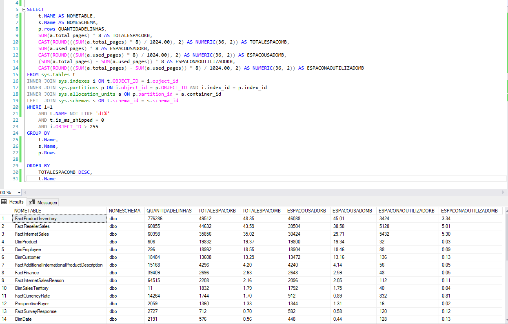

# QUERY-Database-Sizing
Query em SQL utilizada como apoio para realizar o levantamento das métricas de Database Sizing.

Um dos processos durante a modelagem e construção de um DW (data warehouse) ou DM (data mart) é realizar a estimativa do espaço em disco que será ocupado por esse banco de dados. 

Para isso, é recomendado algumas etapas como:   
- Realizar a estimativa de cada linha na tabela FATO (Pode se utilizar a coluna QUANTIDADELINHAS). 
- Determinar a granularidade das tabelas DIMENSÃO.  
- Realizar uma multiplicação entre o número de linhas de todas as tabelas dimensões, após risso multiplicar o resultado pelo tamanho de cada linha na(s) tabela(s) FATO(S). 
- Feito isso, avaliar o tipo da tabela FATO em esparsa ou densa (não irei me aprofundar no conceito visto que há muitas interpretações, mas em geral, uma tabela fato densa possui valores para as chaves estrangeiras mesmo que os fatos não aconteceram, indicando um valor genérico na dimensão. Já uma tabela esparsa, já a tabela fato esparsa possui um número pequeno de combinações entre as chaves estrangeiras e chaves primárias das tabelas dimensões) para estimar uma possível redução ou aumento do tamanho do banco de dados.

Fontes: 

ACADEMY, Data Science. Design e Implementação de Data Warehouses. Disponível em: https://www.datascienceacademy.com.br/course/design-e-implementacao-de-data-warehouses. Acesso em: 07 set. 2021.

KIMBALL, Ralph; ROSS, Margy. The Data Warehouse Toolkit: the definitive guide to dimensional modeling. 3. ed. Canadá: John Wiley & Sons, 2013. 564 p.